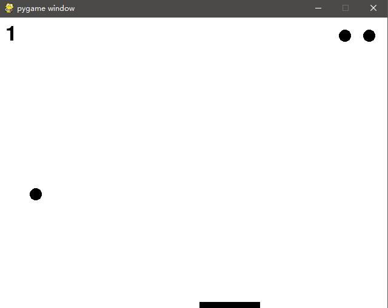

# Pong-Reinforcement-Learning
Pong-Reinforcement-Learning Here

# Installation Dependencies:
- python3
- pytorch = 1.5.1
- pygame
- numpy
- opencv

# How to Run?
## Training:  
set ``train = True`` in DDQN_with_Pong.py and run with following command:  
```python DDQN_with_Pong.py```
## Inference:  #
set ``train = False`` in DDQN_with_Pong.py and run with following command:  
```python DDQN_with_Pong.py```

# Visualization

